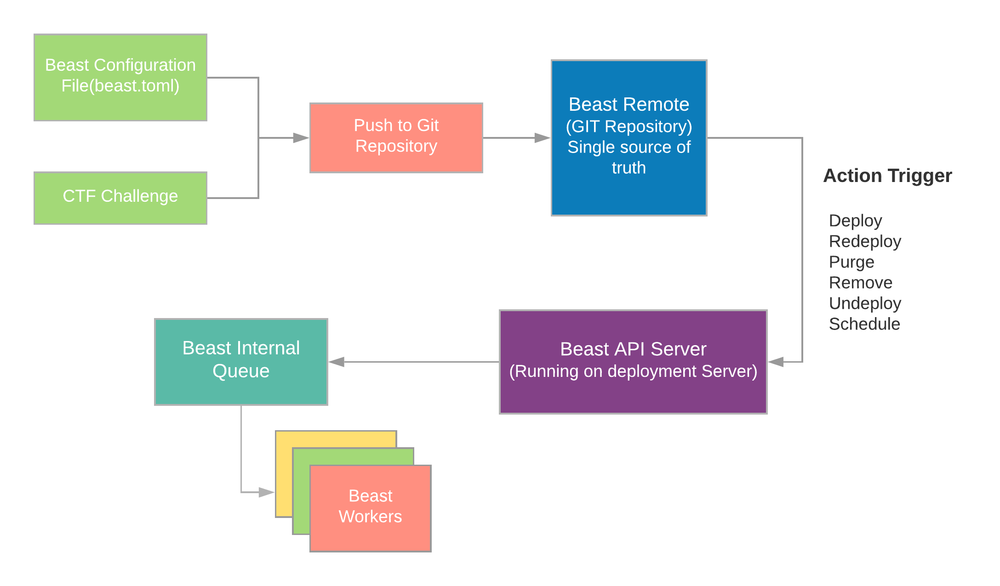

# Architecture

This section deals with how the different pieces of beast fall together to create a robust and flexible
deployment pipeline. For internals of each section itself go to respective documentation pages.

Important components of beast are described below:

### API Server

API server is the interface provided by beast to interact with the underlying application. All the actions performed by beast
are propogated by an external agent from this point. The API server is a HTTP REST API service built on top of go-gin framework.
For authentication purposes it uses JWT which can be optionally turned off when running the server.

Requests for beast API are split across five namespaces

* **manage**: Challenge management related APIs. Ex. Deploy, Undeploy etc.
* **info**: Challenge information related APIs. Ex. ChallengeInfo etc.
* **status**: Challenge status related APIs. Ex. Challenge status
* **remote**: Beast remote repository related APIs. Ex. SyncRemote
* **config**: Beast global configuration related APIs. Ex. Reload Config

### Manager

This part is the brains of beast and does all the action corresponding to lifecycle management of challenges along with managing configuration
and authentication. The part lives inside `core/` directory and uses helpers/interfaces from inside of `pkg/` and `/utils`.

### Container Runtime

Container runtime is a wrapper around docker client library which provides beast with helper function to deal with underlying container runtime.

Currently this only supports `docker` as an underlying container runtime but we will soon be creating a generalized interface which can be fulfilled
by most of the container runtimes. Something similar on the lines of CRI(Container Runtime Interface for kubernetes).

### Queue and Workers

All the tasks performed by beast are non synchronous and are handled by a queue. Whenever a new action is performed corresponding to beast API
a new task is created using the action configuration and pushed to an internal queue. The result is returned immediately by the API server notifying about
the start of the process.

Beast workers are the actual underlying goroutines which handles the tasks assigned by the Queue. They perform the required task an then takes on
the next. Consider them as the threadpool for beast.

## Challenge Flow

## Deployment Pipeline

