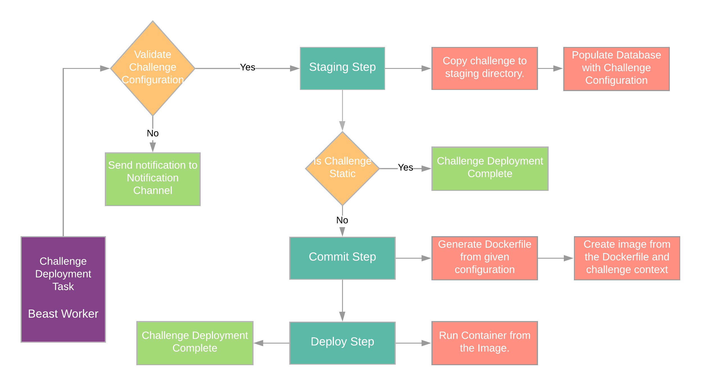

# Deployment

Deploying challenge is completely handled by beast, once the author is done with creating the required
challenge he can invoke deploy endpoints from beast to trigger the deployment pipeline for the challenge.

The deployment model for beast is based on `git`, you can think of a git repository as a single source of 
truth for all the challenge configuraiton. Using this `gitops` based approach provides a lot of benifits
in terms of flexibility and robustness of the applications.

Every challenge that we create/add to the repository we can first verify is working and then can also do an
automatic deployment for the same. This is quite helpful for wargames like website where earlier for each challenge you
would have to manually deploy the challenge.

Using this gitops based approach provides us with all the benifits that modern days deployment pipelines have. Also,
it helps to easily extend the use cases around how beast can be used in different types of scenarios like for Jeopardy style
challenges, Wargames websites, CTF competitions etc.

## Flow

## Note

There are a lot of features which we can have when using a git repository as the source of truth for the application.
Beast still does not make use of all of them. There are a few features which are still in pipeline, in the same context
you can hope to see them in future releases of beast.
